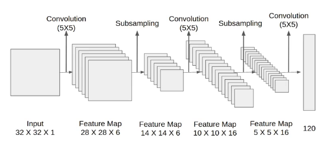
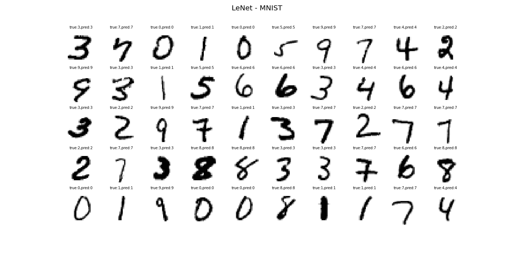
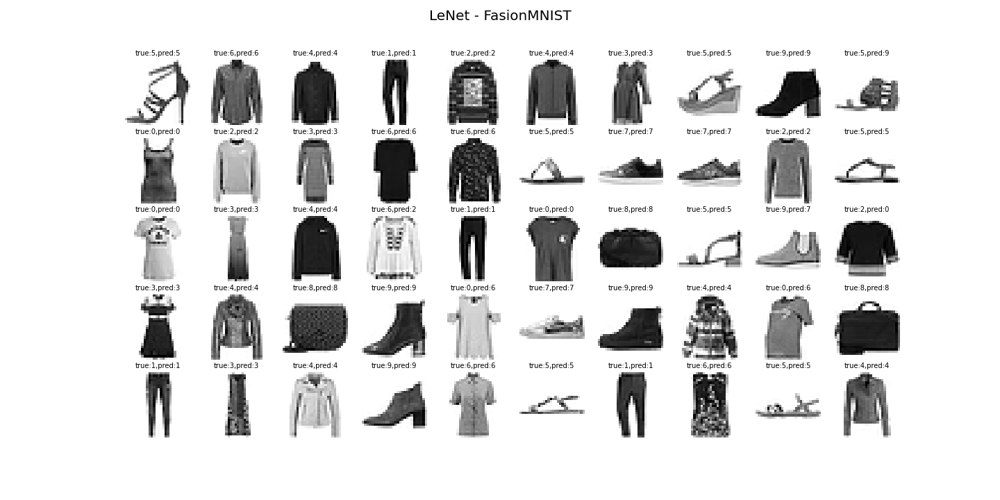
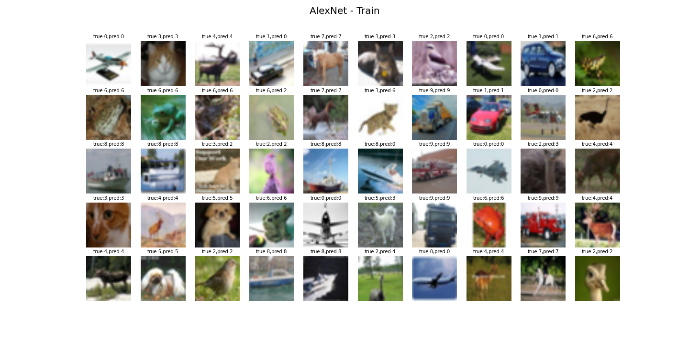
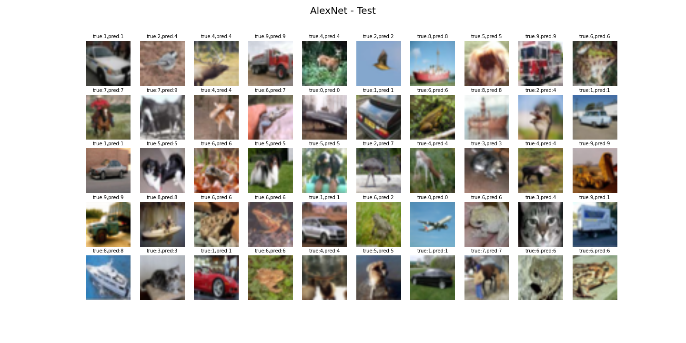
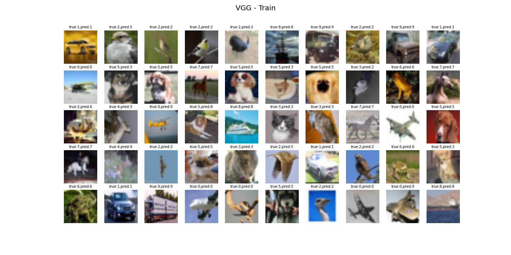
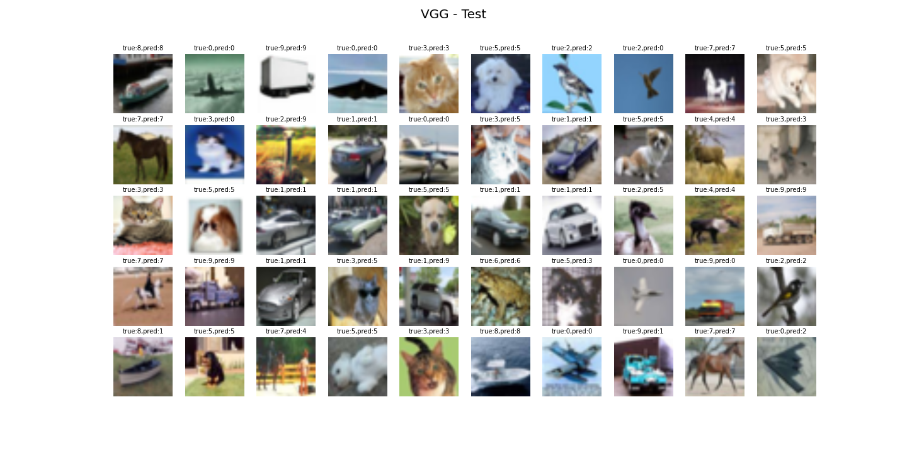
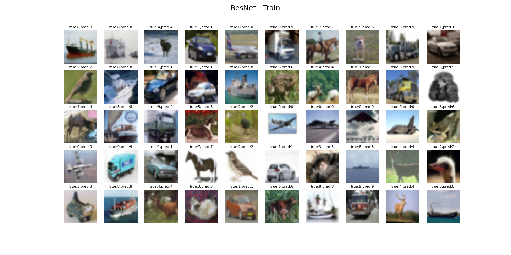
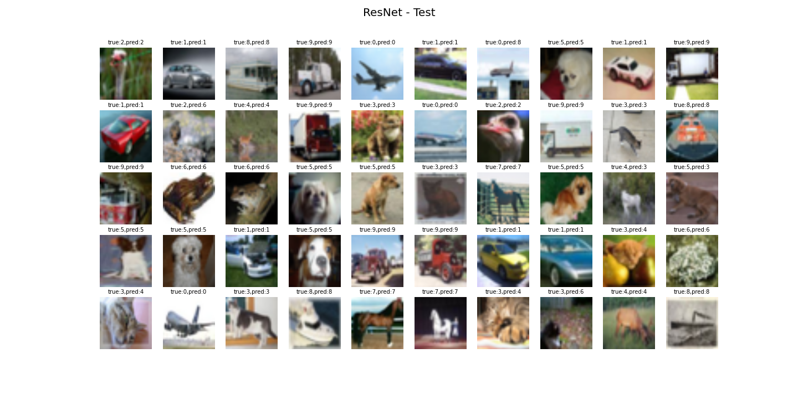

# Deep Learning for Images
In this repository, I will implement the different convolutional neural networks by PyTorch. Reproduce the original model and then play around by using different datasets. Furthermore, we can use a pre-trained model and implement transfer learning.  
This repository will follow Prof Mu's [Introduce to Deep Learning](https://courses.d2l.ai/).
   
# LeNet
LeNet is a simple convolutional neural network. It used 2 convolutional layers, 2 pooling layers and 3 linear layer to deal with classification problem. This model works well on the MNIST dataset.  


  
The Structure of LeNet:
```python
# convolutional layers
nn.Conv2d(in_channels=1,out_channels=6,kernel_size=(5,5),padding=2),nn.Tanh(),
nn.AvgPool2d(kernel_size=(2,2),stride=2)
nn.Conv2d(in_channels=6,out_channels=16,kernel_size=(5,5)),nn.Tanh(),
nn.AvgPool2d(kernel_size=(2,2),stride=2)
# fully connected layers
nn.Linear(400,120),nn.Tanh()
nn.Linear(120,84),nn.Tanh()
nn.Linear(84,10)
```

Using the same dataset and reproducing a similar model, it's easy to get a good result without spending lots of time in hyperparameter tuning. In the [notebook](https://github.com/ZhipengHong0123/DL_image/blob/main/LeNet/LeNet.ipynb), I train the model with two different dataset: MNIST and FashionMNIST. The LeNet predict well on both image classification task. The training loss and test loss decrease fast when using SGD optimizer. Without training lots of epochs. The model gets high accuracy in the test set.  
  
These are pictures of LeNet prediction by different datasets.
  





# AlexNet
Compared to LeNet, AlexNet added more convolutional layers into the model. Furthermore, AlexNet uses max-pooling layers after each convolutional layer. At last, it use three fully connected layers and used Relu as activation functions. This is Pytorch code to reproduce the Structure of the AlexNet:
```python 
nn.Conv2d(in_channels=3,out_channels=96,kernel_size=11,stride=4),nn.ReLU(),
nn.MaxPool2d(kernel_size=3,stride=2),
nn.Conv2d(in_channels=96,out_channels=256,kernel_size=5,padding=2),nn.ReLU(),
nn.MaxPool2d(kernel_size=3,stride=2),
nn.Conv2d(in_channels=256,out_channels=384,kernel_size=3,padding=1),nn.ReLU(),
nn.Conv2d(in_channels=384,out_channels=384,kernel_size=3,padding=1),nn.ReLU(),
nn.Conv2d(in_channels=384,out_channels=256,kernel_size=3,padding=1),nn.ReLU(),
nn.MaxPool2d(kernel_size=3,stride=2),
nn.Flatten(),
nn.Linear(5*5*256,4096),nn.ReLU(),
nn.Dropout(0.5),
nn.Linear(4096,4096),nn.ReLU(),
nn.Dropout(0.5),
nn.Linear(4096,10)
```
These are result of AlexNet




# VGG
VGGnet was constructed by block. Each block has a similar structure but has different hyperparameters. In the first layer of each block, VGGnet uses a convolutional layer with kernel size = 3 and padding = 1 but double the output channel and doesn't change the shape of the picture (width, height). Then in the last layers, it uses a max-pooling layer in which kernel size = 2 and stride = 2 which decreases half of the image size. Usually, we double the output channel and decrease half of the image size.
```python
# Code for block
def block_(self,nums,in_channel,out_channel):
    layers=[]
    # add convolution layers (didnt change shape)
    for _ in range(nums):
        layers.append(nn.Conv2d(in_channels=in_channel,out_channels=out_channel,kernel_size=3,padding=1))
        layers.append(nn.ReLU())
        in_channel=out_channel
    # reduce shape by half using maxpool
    layers.append(nn.MaxPool2d(kernel_size=2,stride=2))
    return nn.Sequential(*layers)
```
Then we can construct our model using block. We can build VGG-11 or VGG-16. And in my jupyter notebook, I will build two models but owing to limited resources I will only try VGG-11 on CIFAR10. These are the result of VGG. In the training set, we can train the model very well with extremely high accuracy but this will lead to overfitting so I used weight decay and dropout to prevent overfitting.





# ResNet
ResNet is similar to VGG and uses block but it adds X from the previous block. We can also choose whether use one convolutional layer to process X. Furthermore, instead of using max-pooling, ResNet uses the Batch Norm layer.
```python
class ResNetblock(nn.Module):
    def __init__(self,input_channel,out_channel,stride=1, convx=False):
        super(ResNetblock,self).__init__()
        self.C1 = nn.Conv2d(input_channel,out_channel,kernel_size=3,padding=1,stride=stride)
        self.B1 = nn.BatchNorm2d(out_channel)
        self.relu = nn.ReLU()
        self.C2 = nn.Conv2d(out_channel,out_channel,kernel_size=3,padding=1)
        self.B2 = nn.BatchNorm2d(out_channel)

        if convx:
            self.CX = nn.Conv2d(input_channel,out_channel,kernel_size=1,stride=stride)
        else:
            self.CX=None

    def forward(self,X):
        Y = self.relu(self.B1(self.C1(X)))
        Y = self.B2(self.C2(Y))
        if self.CX:
            X = self.CX(X)
        Y+=X
        return F.relu(Y)
```
Using block we can build our model and train on the dataset. ResNet perform best with accuracy **0.85** on the test dataset compared with other models.





